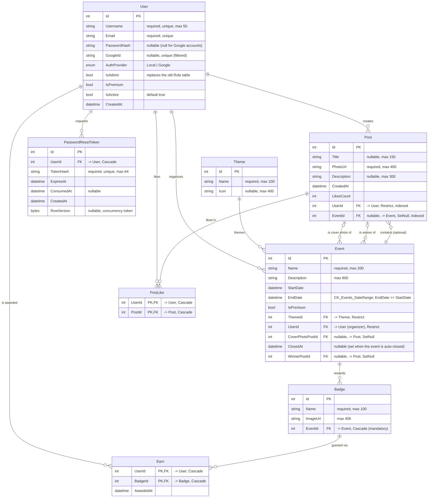

# Schéma de base de données — Lensmania

> Schéma relationnel **reflétant l'implémentation réelle** (entités EF Core + `AppDbContext` + migrations).
> Source de vérité : `LensmaniaServer/Models/`, `LensmaniaServer/Database/AppDbContext.cs`, `LensmaniaServer/Migrations/`.
>

## Notes de modélisation

- **Authentification** : `User.PasswordHash` est nullable car un compte créé via Google n'a pas de mot de passe local. `AuthProvider` distingue `Local` / `Google` ; `GoogleId` porte un index unique filtré (`WHERE "GoogleId" IS NOT NULL`).
- **Rôles** : il n'y a pas de table `Role`. Le statut administrateur est porté par le booléen `User.IsAdmin` (policy `AdminOnly` côté API).
- **Événements (concours)** :
  - `UserId` = organisateur de l'événement.
  - `CoverPhotoPostId` = photo de couverture (un `Post`, optionnel).
  - `ClosedAt` + `WinnerPostId` sont renseignés automatiquement par `EventClosingBackgroundService` à la clôture.
  - Contrainte CHECK `CK_Events_DateRange` : `EndDate >= StartDate`.
- **Likes** : table d'association `PostLike` à clé composite `(UserId, PostId)`. `Post.LikesCount` est un compteur dénormalisé.
- **Badges / récompenses** : un `Badge` appartient obligatoirement à un `Event` (suppression en cascade). `Earn` associe un `User` à un `Badge` avec la date d'attribution `(UserId, BadgeId)`.
- **Réinitialisation de mot de passe** : `PasswordResetToken` stocke le hash du jeton (jamais le jeton en clair), avec expiration, consommation à usage unique et jeton de concurrence `RowVersion`. Index `(UserId, ConsumedAt)`.

## Écarts avec les anciens diagrammes (`MCD_Lensmania.jpg` / `MLD_Lensmania.jpg`)

Les anciennes images contenaient des entités **prévisionnelles non implémentées**, retirées ici : `Role`, `Country`, `Subscription`, `Payment` et la relation d'abonnement `follow`. Principales corrections par rapport à elles :

- `User` : suppression de `avatar`, `role_id`, `country_code`, `event_id` ; ajout de `GoogleId`, `AuthProvider`, `IsAdmin` ; `password` → `PasswordHash` (nullable).
- `Post` : `photo` → `PhotoUrl` ; suppression de `country_code`.
- `Event` : ajout de `Description`, `UserId`, `CoverPhotoPostId`, `ClosedAt`, `WinnerPostId` + contrainte de dates.
- `Badge` : ajout de `Name` ; `image` → `ImageUrl` ; lien à `Event` rendu obligatoire.
- `PostLike` : pas de colonne `liked_at` (contrairement à l'ancien diagramme).
- Ajout de la table `PasswordResetToken`, absente des anciens schémas.
